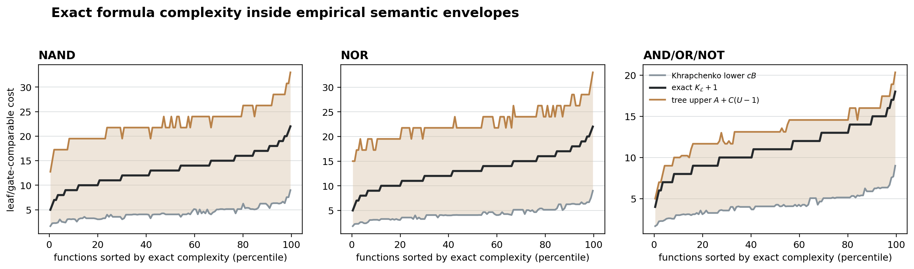
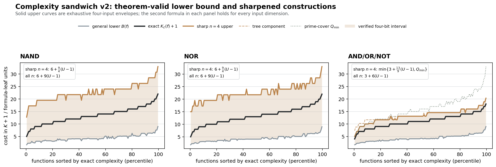
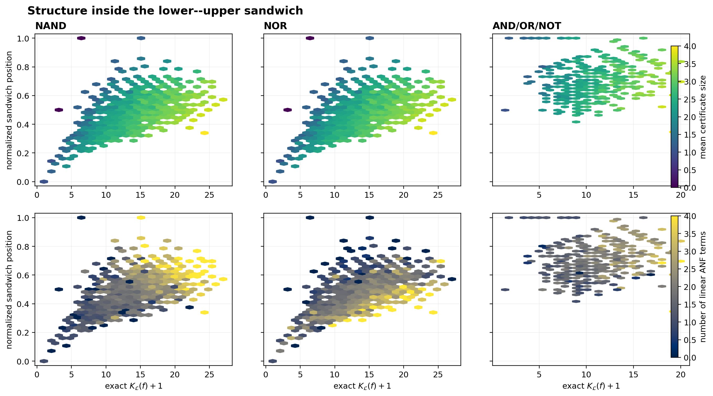

# Semantic lower--upper sandwich

For every four-input function, this analysis verifies

```text
B(f) <= K_L(f) + 1 <= A_L + C_L (U(f) - 1).
```

Here `B` is the Khrapchenko product and `U` is minimum deterministic
decision-tree leaf count. The displayed `A` and `C` are the sharp constants
for this affine parameterization on the finite four-input universe; they are
empirical extremal constants, not asymptotic theorems.





## Tight empirical envelopes

| language   |   lower_scale |   upper_anchor |   upper_slope |   exact_cover_contacts |   minimum_lower_slack |   minimum_upper_slack |   median_band_width |   position_q10 |   position_median |   position_q90 |   lower_contacts |   upper_contacts |   collapsed_intervals |
|:-----------|--------------:|---------------:|--------------:|-----------------------:|----------------------:|----------------------:|--------------------:|---------------:|------------------:|---------------:|-----------------:|-----------------:|----------------------:|
| NAND       |             1 |              6 |        2.25   |                      0 |                     0 |                     0 |             18.6    |         0.3663 |            0.48   |         0.5946 |                4 |                2 |                     0 |
| NOR        |             1 |              6 |        2.25   |                      0 |                     0 |                     0 |             18.6    |         0.3663 |            0.48   |         0.5946 |                4 |                2 |                     0 |
| AND_OR_NOT |             1 |              3 |        1.4444 |                    986 |                     0 |                     0 |              9.1556 |         0.631  |            0.7516 |         0.8772 |                4 |             1014 |                     4 |

Thus NAND and NOR use `B <= K + 1 <= 6 + (9/4)(U - 1)`. The
AND/OR/NOT envelope is

```text
B <= K + 1 <= min(3 + (13/9)(U - 1), Q_min).
```

`Q_min` is the exact minimum among prime DNF/CNF cover constructions,
including variants that retain one outer NOT. Cube weights account for
literal polarity, internal binary gates, cover-combining gates, and the
outer NOT when present. Constants are assigned cost `K + 1 = 3` because
the language provides no free constants.

## Mathematical status

The lower inequality `B <= K + 1` holds generally in all three languages.
Push negations to literals to obtain a De Morgan formula without changing
its leaves. Khrapchenko gives `B <= leaves`; a tree with `b` binary gates
has `b + 1` leaves, and `b + 1 <= K + 1` even when unary NOT gates occur.

Straight Shannon compilation also gives general, constructive but looser
upper bounds:

```text
NAND/NOR:    K + 1 <= 6 + 9(U - 1)
AND/OR/NOT:  K + 1 <= 3 + 6(U - 1).
```

A decision-tree leaf is replaced by a constant formula (at most five gates
for NAND/NOR and two for AND/OR/NOT), and each internal Shannon multiplexer
adds four gates. `Q_min` is also constructive for every function. In
contrast, the much sharper slopes `9/4` and `13/9` are fitted extremal
constants on `n = 4`, not asymptotic theorems.

## Equality cases

| language   | contact   |   functions |   phase_permutation_orbits |
|:-----------|:----------|------------:|---------------------------:|
| AND_OR_NOT | both      |           4 |                          1 |
| AND_OR_NOT | upper     |        1010 |                         55 |
| NAND       | lower     |           4 |                          1 |
| NAND       | upper     |           2 |                          2 |
| NOR        | lower     |           4 |                          1 |
| NOR        | upper     |           2 |                          2 |

Every contact function, its phase/permutation orbit, ANF, active upper
construction, and cover witness is recorded in
`../artifacts/complexity_sandwich_contacts.csv`.

## Structure within the sandwich



The normalized position is `(K + 1 - lower) / (upper - lower)`. Collapsed
exact intervals are assigned the immaterial convention `position = 0.5`.
Color shows
two proposed correction variables: mean certificate size and linear ANF
support.

## Held-out residual models

All models use the same five folds over 3,952 complete compact-profile classes.
The gate-count score reconstructs `K + 1` from the predicted normalized
position and the two envelope curves.

| language   | model               |   features |   position_r2_mean |   position_r2_std |   gate_count_r2_mean |   gate_count_r2_std |
|:-----------|:--------------------|-----------:|-------------------:|------------------:|---------------------:|--------------------:|
| AND_OR_NOT | algebraic + phase   |         10 |             0.2037 |            0.0338 |               0.9069 |              0.0077 |
| AND_OR_NOT | all corrections     |         14 |             0.4729 |            0.031  |               0.9346 |              0.005  |
| AND_OR_NOT | bracket coordinates |          2 |             0.2763 |            0.0438 |               0.91   |              0.0072 |
| AND_OR_NOT | certificates        |          4 |             0.2191 |            0.0339 |               0.9028 |              0.0079 |
| AND_OR_NOT | compact sandwich    |         16 |             0.6099 |            0.0284 |               0.9541 |              0.0036 |
| AND_OR_NOT | fixed midpoint      |          0 |            -6.1289 |            0.2221 |               0.1176 |              0.0448 |
| NAND       | algebraic + phase   |         10 |             0.5566 |            0.0379 |               0.8815 |              0.0102 |
| NAND       | all corrections     |         14 |             0.7569 |            0.0203 |               0.9334 |              0.0037 |
| NAND       | bracket coordinates |          2 |             0.1554 |            0.0278 |               0.7785 |              0.0204 |
| NAND       | certificates        |          4 |             0.5163 |            0.0331 |               0.8703 |              0.007  |
| NAND       | compact sandwich    |         16 |             0.796  |            0.0213 |               0.9458 |              0.0034 |
| NAND       | fixed midpoint      |          0 |            -0.0468 |            0.0142 |               0.7299 |              0.0226 |
| NOR        | algebraic + phase   |         10 |             0.3988 |            0.0119 |               0.838  |              0.0084 |
| NOR        | all corrections     |         14 |             0.713  |            0.0122 |               0.9218 |              0.0049 |
| NOR        | bracket coordinates |          2 |             0.156  |            0.0196 |               0.7789 |              0.0151 |
| NOR        | certificates        |          4 |             0.5118 |            0.0223 |               0.8689 |              0.0079 |
| NOR        | compact sandwich    |         16 |             0.7377 |            0.0072 |               0.9297 |              0.0047 |
| NOR        | fixed midpoint      |          0 |            -0.0467 |            0.0177 |               0.73   |              0.0167 |

The table is generated from the same run as the envelopes, so reported
residual scores cannot silently remain stale after a bound changes. The
compact model combines the two bracket coordinates, certificate summaries,
ANF support, and signed Fourier counts.

## Interpretation

The experiment tests a concrete decomposition: boundary complexity supplies
a lower obstruction, decision-tree decomposability supplies an upper
construction, and certificates plus algebraic phase locate the exact cost
inside that interval. High held-out residual-model scores support this
decomposition; imperfect scores identify the remaining theoretical gap.

## Reproduce

```powershell
python experiments/four_bit/scripts/analyze_complexity_sandwich.py
```
