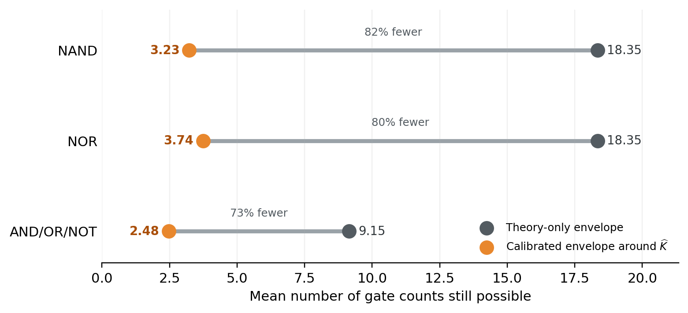

# Learned semantic complexity envelope

The compact sandwich model predicts normalized position between the
Khrapchenko lower endpoint and the decision-tree/prime-cover upper endpoint.
Every point prediction below is out-of-fold over complete 16-coordinate
semantic-profile classes.

## Interval results

| language   | method                               |   nominal_coverage |   mean_lower_allowance |   mean_upper_allowance |   maximum_lower_allowance |   maximum_upper_allowance |   function_coverage |   mean_classical_width |   mean_learned_width |   mean_relative_shrinkage |   median_relative_shrinkage |   fraction_strictly_narrower |   mean_classical_integer_candidates |   mean_learned_integer_candidates |   mean_integer_candidate_reduction |   class_coverage |
|:-----------|:-------------------------------------|-------------------:|-----------------------:|-----------------------:|--------------------------:|--------------------------:|--------------------:|-----------------------:|---------------------:|--------------------------:|----------------------------:|-----------------------------:|------------------------------------:|----------------------------------:|-----------------------------------:|-----------------:|
| NAND       | cross_fitted_exhaustive_max_residual |               1    |                 4.2396 |                 3.9255 |                    4.2396 |                    3.9255 |              1      |                18.3788 |               8.1573 |                    0.5467 |                      0.561  |                       1      |                             18.3471 |                            8.1607 |                             0.5455 |           1      |
| NAND       | split_conformal_class_worst          |               0.9  |                 1.3254 |                 1.2663 |                    1.4695 |                    1.3447 |              0.9183 |                18.3788 |               2.5903 |                    0.856  |                      0.8599 |                       1      |                             18.3471 |                            2.5888 |                             0.8557 |           0.9018 |
| NAND       | split_conformal_class_worst          |               0.95 |                 1.6723 |                 1.5604 |                    1.8007 |                    1.7281 |              0.9631 |                18.3788 |               3.232  |                    0.8203 |                      0.8242 |                       1      |                             18.3471 |                            3.2274 |                             0.8202 |           0.9509 |
| NAND       | split_conformal_class_worst          |               0.99 |                 2.5328 |                 2.2581 |                    2.9792 |                    2.3729 |              0.9934 |                18.3788 |               4.7852 |                    0.734  |                      0.7412 |                       1      |                             18.3471 |                            4.7845 |                             0.7334 |           0.9899 |
| NOR        | cross_fitted_exhaustive_max_residual |               1    |                 3.6108 |                 4.1064 |                    3.6108 |                    4.1064 |              1      |                18.3788 |               7.7135 |                    0.5713 |                      0.5851 |                       1      |                             18.3471 |                            7.7016 |                             0.5709 |           1      |
| NOR        | split_conformal_class_worst          |               0.9  |                 1.5442 |                 1.4987 |                    1.5724 |                    1.6083 |              0.923  |                18.3788 |               3.0426 |                    0.8308 |                      0.8334 |                       1      |                             18.3471 |                            3.0482 |                             0.8301 |           0.9038 |
| NOR        | split_conformal_class_worst          |               0.95 |                 1.9147 |                 1.8297 |                    2.0497 |                    1.9321 |              0.9663 |                18.3788 |               3.7431 |                    0.7919 |                      0.7968 |                       1      |                             18.3471 |                            3.7376 |                             0.7918 |           0.9527 |
| NOR        | split_conformal_class_worst          |               0.99 |                 2.8134 |                 2.6077 |                    3.1625 |                    2.9633 |              0.997  |                18.3788 |               5.4184 |                    0.6988 |                      0.7062 |                       1      |                             18.3471 |                            5.4116 |                             0.6985 |           0.9944 |
| AND_OR_NOT | cross_fitted_exhaustive_max_residual |               1    |                 2.7429 |                 2.0121 |                    2.7429 |                    2.0121 |              1      |                 9.0669 |               4.5528 |                    0.4786 |                      0.502  |                       0.9936 |                              9.148  |                            4.6521 |                             0.4717 |           1      |
| AND_OR_NOT | split_conformal_class_worst          |               0.9  |                 1.0758 |                 0.9204 |                    1.2354 |                    0.9601 |              0.9191 |                 9.0669 |               1.9792 |                    0.771  |                      0.7858 |                       0.9997 |                              9.148  |                            1.9934 |                             0.7712 |           0.9056 |
| AND_OR_NOT | split_conformal_class_worst          |               0.95 |                 1.3676 |                 1.1268 |                    1.6606 |                    1.2043 |              0.9636 |                 9.0669 |               2.4644 |                    0.7153 |                      0.7321 |                       0.9995 |                              9.148  |                            2.4764 |                             0.7168 |           0.9524 |
| AND_OR_NOT | split_conformal_class_worst          |               0.99 |                 1.9291 |                 1.5384 |                    2.2014 |                    1.6936 |              0.9924 |                 9.0669 |               3.3851 |                    0.6106 |                      0.6329 |                       0.9984 |                              9.148  |                            3.4211 |                             0.6098 |           0.9904 |

The exhaustive row uses the largest observed one-sided residual of all
65,536 cross-fitted predictions. It is a finite audit of this fixed table,
not a dimension-independent theorem. The calibrated rows use a stricter
three-fold train, one-fold calibrate, one-fold test rotation. Calibration
scores take the worst residual inside each complete semantic class; the two
tails use a Bonferroni split of the stated joint error rate.

For any single split, if the held-out profile class is exchangeable with
the calibration classes, the finite-sample higher quantile gives at least
the nominal simultaneous class-uniform coverage by the union bound. The
five rotating splits reported here are an empirical aggregation of that
grouped split-conformal construction.

Intervals are always intersected with the classical semantic envelope.
Coverage therefore cannot be worse than an un-intersected learned interval.



## Largest cross-fitted point errors

| language   | truth_table   |   exact_k_plus_1 |   predicted_k_plus_1 |   signed_residual_exact_minus_prediction |   classical_lower_k_plus_1 |   classical_upper_k_plus_1 |
|:-----------|:--------------|-----------------:|---------------------:|-----------------------------------------:|---------------------------:|---------------------------:|
| AND_OR_NOT | 0xeac7        |                9 |               11.743 |                                   -2.743 |                      4.267 |                     14.556 |
| AND_OR_NOT | 0xead3        |                9 |               11.743 |                                   -2.743 |                      4.267 |                     14.556 |
| AND_OR_NOT | 0xebc5        |                9 |               11.743 |                                   -2.743 |                      4.267 |                     14.556 |
| AND_OR_NOT | 0xebd1        |                9 |               11.743 |                                   -2.743 |                      4.267 |                     14.556 |
| AND_OR_NOT | 0xeca7        |                9 |               11.743 |                                   -2.743 |                      4.267 |                     14.556 |
| NAND       | 0x6996        |               24 |               28.24  |                                   -4.24  |                     16     |                     39.75  |
| NAND       | 0x0000        |                6 |                2.074 |                                    3.926 |                      0     |                      6     |
| NAND       | 0x9669        |               24 |               27.646 |                                   -3.646 |                     16     |                     39.75  |
| NAND       | 0x6bde        |               16 |               19.451 |                                   -3.451 |                      7.273 |                     30.75  |
| NAND       | 0x6bf6        |               16 |               19.451 |                                   -3.451 |                      7.273 |                     30.75  |
| NOR        | 0xffff        |                6 |                1.894 |                                    4.106 |                      0     |                      6     |
| NOR        | 0x6996        |               24 |               27.611 |                                   -3.611 |                     16     |                     39.75  |
| NOR        | 0x6eef        |               16 |               12.478 |                                    3.522 |                      3     |                     21.75  |
| NOR        | 0x7afb        |               16 |               12.478 |                                    3.522 |                      3     |                     21.75  |
| NOR        | 0x7cfd        |               16 |               12.478 |                                    3.522 |                      3     |                     21.75  |

## Interpretation

A useful learned envelope must jointly achieve high held-out coverage and
material width reduction. Mean and median relative shrinkage are computed
per function against the original interval; already-collapsed classical
intervals receive shrinkage one by convention. Integer-candidate columns
also round the endpoints to the feasible integral values of `K + 1`.

The model supplies the interval center, while calibration or exhaustive
verification supplies the error allowance. Only the classical endpoints
remain dimension-independent mathematical bounds at this stage.

## Reproduce

```powershell
python experiments/four_bit/scripts/analyze_learned_envelope.py
```
