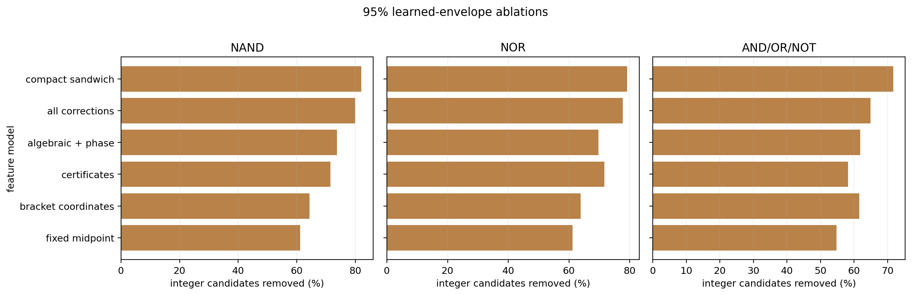

# Learned-envelope feature ablations

Each row uses the same compact-profile folds and nominal 95% grouped
calibration protocol. The midpoint has no learned features.

| language   | model               |   features |   point_r2 |   point_rmse |   function_coverage |   class_coverage |   mean_relative_shrinkage |   mean_integer_candidate_reduction |   mean_learned_integer_candidates |
|:-----------|:--------------------|-----------:|-----------:|-------------:|--------------------:|-----------------:|--------------------------:|-----------------------------------:|----------------------------------:|
| NAND       | fixed midpoint      |          0 |     0.7309 |       1.6553 |              0.9635 |           0.9507 |                    0.6127 |                             0.6119 |                            6.9639 |
| NAND       | bracket coordinates |          2 |     0.7793 |       1.499  |              0.9653 |           0.9484 |                    0.6431 |                             0.6431 |                            6.4062 |
| NAND       | certificates        |          4 |     0.8704 |       1.1485 |              0.9693 |           0.9532 |                    0.7164 |                             0.7147 |                            5.1193 |
| NAND       | algebraic + phase   |         10 |     0.8818 |       1.0972 |              0.9643 |           0.9522 |                    0.7371 |                             0.7367 |                            4.7242 |
| NAND       | all corrections     |         14 |     0.9335 |       0.8227 |              0.9596 |           0.9471 |                    0.7995 |                             0.7993 |                            3.6017 |
| NAND       | compact sandwich    |         16 |     0.9459 |       0.7422 |              0.9631 |           0.9509 |                    0.8203 |                             0.8202 |                            3.2274 |
| NOR        | fixed midpoint      |          0 |     0.7309 |       1.6553 |              0.9653 |           0.9514 |                    0.6129 |                             0.6116 |                            6.9671 |
| NOR        | bracket coordinates |          2 |     0.7797 |       1.4975 |              0.9719 |           0.9577 |                    0.6403 |                             0.6387 |                            6.4894 |
| NOR        | certificates        |          4 |     0.8695 |       1.1526 |              0.9696 |           0.9545 |                    0.7168 |                             0.7165 |                            5.0851 |
| NOR        | algebraic + phase   |         10 |     0.8384 |       1.2827 |              0.9607 |           0.9481 |                    0.6981 |                             0.6974 |                            5.4268 |
| NOR        | all corrections     |         14 |     0.9221 |       0.8905 |              0.9707 |           0.958  |                    0.7772 |                             0.7768 |                            4.0047 |
| NOR        | compact sandwich    |         16 |     0.93   |       0.8442 |              0.9663 |           0.9527 |                    0.7919 |                             0.7918 |                            3.7376 |
| AND_OR_NOT | fixed midpoint      |          0 |     0.1196 |       2.4449 |              0.9768 |           0.9686 |                    0.5558 |                             0.5472 |                            4.0333 |
| AND_OR_NOT | bracket coordinates |          2 |     0.9103 |       0.7803 |              0.9631 |           0.9539 |                    0.6242 |                             0.6152 |                            3.3758 |
| AND_OR_NOT | certificates        |          4 |     0.9031 |       0.8112 |              0.9633 |           0.9524 |                    0.5806 |                             0.5823 |                            3.6572 |
| AND_OR_NOT | algebraic + phase   |         10 |     0.9072 |       0.7938 |              0.9603 |           0.9476 |                    0.6164 |                             0.6186 |                            3.3336 |
| AND_OR_NOT | all corrections     |         14 |     0.9347 |       0.6657 |              0.9658 |           0.9557 |                    0.6476 |                             0.6495 |                            3.066  |
| AND_OR_NOT | compact sandwich    |         16 |     0.9542 |       0.5578 |              0.9636 |           0.9524 |                    0.7153 |                             0.7168 |                            2.4764 |



The compact model should be judged against the midpoint by interval
shrinkage at comparable held-out coverage, not only by point-prediction
R-squared.

## Reproduce

```powershell
python experiments/four_bit/scripts/analyze_learned_envelope_ablations.py
```
