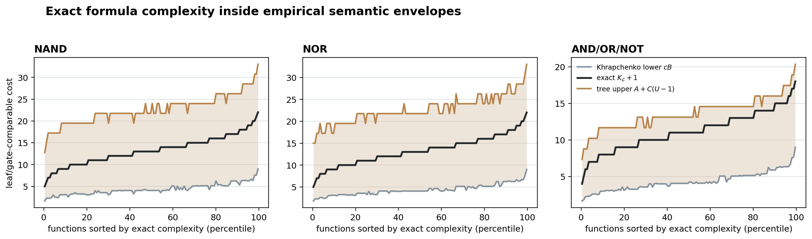
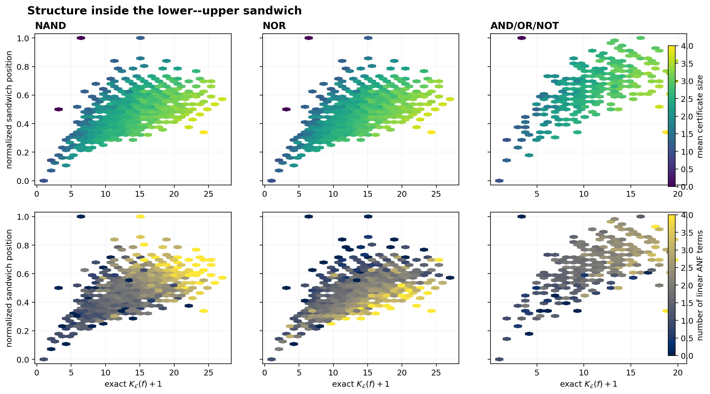

# Semantic lower--upper sandwich

For every four-input function, this analysis places exact `K + 1` between
a scaled Khrapchenko boundary lower curve and an affine decision-tree upper
curve. Constants are the tightest values on this finite universe under the
displayed parameterization; they are empirical extremal constants, not new
asymptotic theorems.



## Tight empirical envelopes

| language   |   lower_scale |   upper_anchor |   upper_slope |   minimum_lower_slack |   minimum_upper_slack |   median_band_width |   position_q10 |   position_median |   position_q90 |   lower_contacts |   upper_contacts |
|:-----------|--------------:|---------------:|--------------:|----------------------:|----------------------:|--------------------:|---------------:|------------------:|---------------:|-----------------:|-----------------:|
| NAND       |             1 |              6 |        2.25   |                     0 |                     0 |             18.6    |         0.3663 |            0.48   |         0.5946 |                4 |                2 |
| NOR        |             1 |              6 |        2.25   |                     0 |                     0 |             18.6    |         0.3663 |            0.48   |         0.5946 |                4 |                2 |
| AND_OR_NOT |             1 |              3 |        1.4444 |                     0 |                     0 |              9.4127 |         0.5658 |            0.7308 |         0.866  |                4 |               30 |

The affine upper curve uses `A + C(U - 1)`. Its anchor `A` accounts for
constant functions, whose decision trees have one leaf although the gate
languages do not provide free constants.

## Structure within the sandwich



The normalized position is `(K + 1 - lower) / (upper - lower)`. Color shows
two proposed correction variables: mean certificate size and linear ANF
support.

## Held-out residual models

All models use the same five folds over 3,952 complete compact-profile classes.
The gate-count score reconstructs `K + 1` from the predicted normalized
position and the two envelope curves.

| language   | model               |   features |   position_r2_mean |   position_r2_std |   gate_count_r2_mean |   gate_count_r2_std |
|:-----------|:--------------------|-----------:|-------------------:|------------------:|---------------------:|--------------------:|
| AND_OR_NOT | algebraic + phase   |         10 |             0.3276 |            0.0325 |               0.8794 |              0.0085 |
| AND_OR_NOT | all corrections     |         14 |             0.6177 |            0.0161 |               0.9277 |              0.0054 |
| AND_OR_NOT | bracket coordinates |          2 |             0.4103 |            0.029  |               0.8921 |              0.0087 |
| AND_OR_NOT | certificates        |          4 |             0.4255 |            0.0168 |               0.8932 |              0.0076 |
| AND_OR_NOT | compact sandwich    |         16 |             0.7255 |            0.0121 |               0.9502 |              0.0025 |
| AND_OR_NOT | fixed midpoint      |          0 |            -3.4565 |            0.1684 |               0.1626 |              0.0466 |
| NAND       | algebraic + phase   |         10 |             0.5566 |            0.0379 |               0.8815 |              0.0102 |
| NAND       | all corrections     |         14 |             0.7569 |            0.0203 |               0.9334 |              0.0037 |
| NAND       | bracket coordinates |          2 |             0.1554 |            0.0278 |               0.7785 |              0.0204 |
| NAND       | certificates        |          4 |             0.5163 |            0.0331 |               0.8703 |              0.007  |
| NAND       | compact sandwich    |         16 |             0.796  |            0.0213 |               0.9458 |              0.0034 |
| NAND       | fixed midpoint      |          0 |            -0.0468 |            0.0142 |               0.7299 |              0.0226 |
| NOR        | algebraic + phase   |         10 |             0.3988 |            0.0119 |               0.838  |              0.0084 |
| NOR        | all corrections     |         14 |             0.713  |            0.0122 |               0.9218 |              0.0049 |
| NOR        | bracket coordinates |          2 |             0.156  |            0.0196 |               0.7789 |              0.0151 |
| NOR        | certificates        |          4 |             0.5118 |            0.0223 |               0.8689 |              0.0079 |
| NOR        | compact sandwich    |         16 |             0.7377 |            0.0072 |               0.9297 |              0.0047 |
| NOR        | fixed midpoint      |          0 |            -0.0467 |            0.0177 |               0.73   |              0.0167 |

Certificates alone explain 51.6%, 51.2%, and 42.6% of normalized-position
variance for NAND, NOR, and AND/OR/NOT. Algebraic support plus Fourier
phase explains 55.7%, 39.9%, and 32.8%. Combining the two raises those
values to 75.7%, 71.3%, and 61.8%; adding the two bracket coordinates
reaches 79.6%, 73.8%, and 72.6%. The gain from combination is evidence
that boundary/decomposition and algebraic structure contribute distinct
parts of the remaining signal.

## Interpretation

The experiment tests a concrete decomposition: boundary complexity supplies
a lower obstruction, decision-tree decomposability supplies an upper
construction, and certificates plus algebraic phase locate the exact cost
inside that interval. High held-out residual-model scores support this
decomposition; imperfect scores identify the remaining theoretical gap.

## Reproduce

```powershell
python experiments/semantic-boolean-complexity-4bit/scripts/analyze_complexity_sandwich.py
```
