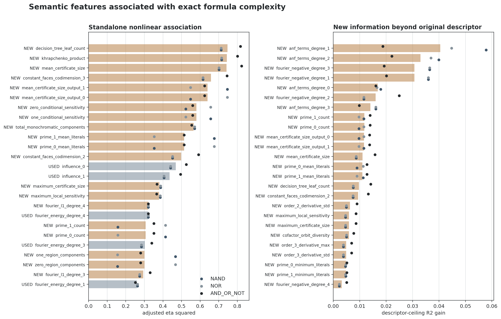

# Feature association with exact Boolean formula complexity

The ranking covers all 65,536 four-input functions. The primary statistic is
adjusted correlation ratio (eta squared): the fraction of gate-count variance
explained by a scalar feature without assuming a linear or monotone relation,
adjusted for the feature's number of distinct values. Spearman rho records
monotone association. Conditional ceiling gain asks how much information the
feature adds beyond the paper's complete original descriptor. These are
population descriptions, not causal effects.



## Overall ranking

| feature                        | status   | family            |   mean adjusted eta squared |   mean absolute spearman |   mean conditional ceiling gain |   distinct values |
|:-------------------------------|:---------|:------------------|----------------------------:|-------------------------:|--------------------------------:|------------------:|
| decision_tree_leaf_count       | new      | decision trees    |                      0.7474 |                   0.8485 |                          0.0097 |                16 |
| khrapchenko_product            | new      | local sensitivity |                      0.7439 |                   0.8336 |                          0.0000 |                44 |
| mean_certificate_size          | new      | certificates      |                      0.7419 |                   0.8224 |                          0.0111 |                36 |
| constant_faces_codimension_3   | new      | restrictions      |                      0.6582 |                   0.7926 |                          0.0000 |                15 |
| mean_certificate_size_output_1 | new      | certificates      |                      0.6397 |                   0.5465 |                          0.0117 |                72 |
| mean_certificate_size_output_0 | new      | certificates      |                      0.6397 |                   0.5465 |                          0.0117 |                72 |
| zero_conditional_sensitivity   | new      | local sensitivity |                      0.5798 |                   0.4166 |                          0.0000 |                55 |
| one_conditional_sensitivity    | new      | local sensitivity |                      0.5798 |                   0.4166 |                          0.0000 |                55 |
| total_monochromatic_components | new      | cube topology     |                      0.5651 |                   0.7238 |                          0.0019 |                12 |
| prime_1_mean_literals          | new      | prime cubes       |                      0.5143 |                   0.5517 |                          0.0110 |                54 |
| prime_0_mean_literals          | new      | prime cubes       |                      0.5143 |                   0.5517 |                          0.0110 |                54 |
| constant_faces_codimension_2   | new      | restrictions      |                      0.4978 |                   0.6803 |                          0.0094 |                16 |
| influence_0                    | used     | influence         |                      0.4694 |                   0.6477 |                          0.0000 |                 9 |
| influence_1                    | used     | influence         |                      0.4354 |                   0.6394 |                          0.0000 |                 9 |
| maximum_certificate_size       | new      | certificates      |                      0.3809 |                   0.6180 |                          0.0060 |                 5 |
| maximum_local_sensitivity      | new      | local sensitivity |                      0.3792 |                   0.6177 |                          0.0060 |                 5 |
| fourier_l1_degree_4            | new      | Fourier shape     |                      0.3215 |                   0.4735 |                          0.0000 |                 9 |
| fourier_energy_degree_4        | used     | Fourier magnitude |                      0.3215 |                   0.4735 |                          0.0000 |                 9 |
| prime_1_count                  | new      | prime cubes       |                      0.3071 |                   0.5101 |                          0.0117 |                14 |
| prime_0_count                  | new      | prime cubes       |                      0.3071 |                   0.5101 |                          0.0117 |                14 |
| fourier_energy_degree_3        | used     | Fourier magnitude |                      0.3026 |                   0.5667 |                          0.0000 |                15 |
| one_region_components          | new      | cube topology     |                      0.3013 |                   0.4913 |                          0.0019 |                 9 |
| zero_region_components         | new      | cube topology     |                      0.3013 |                   0.4913 |                          0.0019 |                 9 |
| fourier_l1_degree_3            | new      | Fourier shape     |                      0.2935 |                   0.5512 |                          0.0002 |                 7 |
| fourier_energy_degree_1        | used     | Fourier magnitude |                      0.2596 |                   0.4624 |                          0.0000 |                15 |
| influence_2                    | used     | influence         |                      0.2535 |                   0.4722 |                          0.0000 |                 9 |
| fourier_l1_degree_1            | new      | Fourier shape     |                      0.2208 |                   0.4343 |                          0.0008 |                 7 |
| prime_1_minimum_literals       | new      | prime cubes       |                      0.1892 |                   0.3840 |                          0.0048 |                 5 |
| prime_0_minimum_literals       | new      | prime cubes       |                      0.1892 |                   0.3840 |                          0.0048 |                 5 |
| anf_terms_degree_1             | new      | ANF support       |                      0.1346 |                   0.3100 |                          0.0405 |                 5 |

## Strict validation of leading compact additions

| feature_addition          |   AND_OR_NOT |   NAND |    NOR |
|:--------------------------|-------------:|-------:|-------:|
| anf_terms_degree_0        |       0.8546 | 0.7663 | 0.7676 |
| anf_terms_degree_1        |       0.8982 | 0.8568 | 0.8391 |
| anf_terms_degree_2        |       0.8870 | 0.8488 | 0.8404 |
| current_descriptor        |       0.8435 | 0.7774 | 0.7774 |
| fourier_negative_degree_1 |       0.9013 | 0.8703 | 0.8703 |
| fourier_negative_degree_2 |       0.8598 | 0.8500 | 0.8469 |
| fourier_negative_degree_3 |       0.8980 | 0.8444 | 0.8444 |

## Feature definitions and mathematical rationale

`used` means the feature was in the paper; `new` means it was added here.
Evidence labels distinguish direct bounds from indirect precedent and
exploratory hypotheses.

| feature                        | status   | family             | evidence                           | source                                                | rationale                                                                                                               |   mean_adjusted_eta_squared |   mean_conditional_ceiling_gain |
|:-------------------------------|:---------|:-------------------|:-----------------------------------|:------------------------------------------------------|:------------------------------------------------------------------------------------------------------------------------|----------------------------:|--------------------------------:|
| anf_terms_degree_0             | new      | ANF support        | compositional hypothesis           | elementary GF(2) gate composition; present hypothesis | Counts algebraic support discarded by degree alone; gate composition acts explicitly on ANF polynomials.                |                      0.0060 |                          0.0169 |
| anf_terms_degree_1             | new      | ANF support        | compositional hypothesis           | elementary GF(2) gate composition; present hypothesis | Counts algebraic support discarded by degree alone; gate composition acts explicitly on ANF polynomials.                |                      0.1346 |                          0.0405 |
| anf_terms_degree_2             | new      | ANF support        | compositional hypothesis           | elementary GF(2) gate composition; present hypothesis | Counts algebraic support discarded by degree alone; gate composition acts explicitly on ANF polynomials.                |                      0.0160 |                          0.0330 |
| anf_terms_degree_3             | new      | ANF support        | compositional hypothesis           | elementary GF(2) gate composition; present hypothesis | Counts algebraic support discarded by degree alone; gate composition acts explicitly on ANF polynomials.                |                      0.0001 |                          0.0140 |
| anf_terms_degree_4             | new      | ANF support        | compositional hypothesis           | elementary GF(2) gate composition; present hypothesis | Counts algebraic support discarded by degree alone; gate composition acts explicitly on ANF polynomials.                |                     -0.0000 |                          0.0000 |
| fourier_negative_degree_0      | new      | Fourier phase      | experimental/compositional         | present controlled-intervention evidence              | Counts coefficient signs discarded by Fourier energy; controlled collisions show basis-specific phase sensitivity.      |                      0.0368 |                          0.0000 |
| fourier_negative_degree_1      | new      | Fourier phase      | experimental/compositional         | present controlled-intervention evidence              | Counts coefficient signs discarded by Fourier energy; controlled collisions show basis-specific phase sensitivity.      |                      0.0143 |                          0.0307 |
| fourier_negative_degree_2      | new      | Fourier phase      | experimental/compositional         | present controlled-intervention evidence              | Counts coefficient signs discarded by Fourier energy; controlled collisions show basis-specific phase sensitivity.      |                      0.0009 |                          0.0160 |
| fourier_negative_degree_3      | new      | Fourier phase      | experimental/compositional         | present controlled-intervention evidence              | Counts coefficient signs discarded by Fourier energy; controlled collisions show basis-specific phase sensitivity.      |                      0.0082 |                          0.0307 |
| fourier_negative_degree_4      | new      | Fourier phase      | experimental/compositional         | present controlled-intervention evidence              | Counts coefficient signs discarded by Fourier energy; controlled collisions show basis-specific phase sensitivity.      |                      0.0089 |                          0.0032 |
| fourier_entropy                | new      | Fourier shape      | Fourier heuristic                  | [2] Fourier concentration; refinement proposed here   | Spectral entropy measures how diffusely Fourier mass is distributed rather than only where by degree.                   |                      0.0201 |                          0.0013 |
| fourier_l1_degree_0            | new      | Fourier shape      | Fourier precedent                  | [2] Fourier concentration; refinement proposed here   | L1 mass refines degree-wise L2 energy and measures spectral concentration within a degree.                              |                      0.0306 |                          0.0000 |
| fourier_l1_degree_1            | new      | Fourier shape      | Fourier precedent                  | [2] Fourier concentration; refinement proposed here   | L1 mass refines degree-wise L2 energy and measures spectral concentration within a degree.                              |                      0.2208 |                          0.0008 |
| fourier_l1_degree_2            | new      | Fourier shape      | Fourier precedent                  | [2] Fourier concentration; refinement proposed here   | L1 mass refines degree-wise L2 energy and measures spectral concentration within a degree.                              |                      0.0332 |                          0.0003 |
| fourier_l1_degree_3            | new      | Fourier shape      | Fourier precedent                  | [2] Fourier concentration; refinement proposed here   | L1 mass refines degree-wise L2 energy and measures spectral concentration within a degree.                              |                      0.2935 |                          0.0002 |
| fourier_l1_degree_4            | new      | Fourier shape      | Fourier precedent                  | [2] Fourier concentration; refinement proposed here   | L1 mass refines degree-wise L2 energy and measures spectral concentration within a degree.                              |                      0.3215 |                          0.0000 |
| fourier_zero_degree_0          | new      | Fourier shape      | Fourier heuristic                  | [2] Fourier concentration; refinement proposed here   | Measures spectral sparsity within a degree, which energy totals cannot recover.                                         |                      0.0034 |                          0.0000 |
| fourier_zero_degree_1          | new      | Fourier shape      | Fourier heuristic                  | [2] Fourier concentration; refinement proposed here   | Measures spectral sparsity within a degree, which energy totals cannot recover.                                         |                      0.0252 |                          0.0000 |
| fourier_zero_degree_2          | new      | Fourier shape      | Fourier heuristic                  | [2] Fourier concentration; refinement proposed here   | Measures spectral sparsity within a degree, which energy totals cannot recover.                                         |                      0.0069 |                          0.0000 |
| fourier_zero_degree_3          | new      | Fourier shape      | Fourier heuristic                  | [2] Fourier concentration; refinement proposed here   | Measures spectral sparsity within a degree, which energy totals cannot recover.                                         |                      0.0550 |                          0.0000 |
| fourier_zero_degree_4          | new      | Fourier shape      | Fourier heuristic                  | [2] Fourier concentration; refinement proposed here   | Measures spectral sparsity within a degree, which energy totals cannot recover.                                         |                      0.0541 |                          0.0000 |
| maximum_absolute_walsh         | new      | Fourier shape      | Fourier precedent                  | [2] Fourier concentration; refinement proposed here   | The largest Walsh coefficient measures proximity to an affine character and refines energy totals.                      |                      0.0179 |                          0.0013 |
| maximum_certificate_size       | new      | certificates       | indirect complexity precedent      | [3] decision-tree complexity survey                   | Worst-case certificate complexity is polynomially related to standard query-complexity measures.                        |                      0.3809 |                          0.0060 |
| mean_certificate_size          | new      | certificates       | indirect complexity precedent      | [3] decision-tree complexity survey                   | Certificates measure how many inputs suffice to force the output and bound decision-tree complexity.                    |                      0.7419 |                          0.0111 |
| mean_certificate_size_output_0 | new      | certificates       | indirect complexity precedent      | [3] decision-tree complexity survey                   | Output-conditioned certificates distinguish the two sides of the truth-table boundary.                                  |                      0.6397 |                          0.0117 |
| mean_certificate_size_output_1 | new      | certificates       | indirect complexity precedent      | [3] decision-tree complexity survey                   | Output-conditioned certificates distinguish the two sides of the truth-table boundary.                                  |                      0.6397 |                          0.0117 |
| one_region_components          | new      | cube topology      | geometric heuristic                | [1] boundary/sensitivity identity; present refinement | Counts disconnected one-regions; it refines the hypercube boundary geometry measured by influence.                      |                      0.3013 |                          0.0019 |
| total_monochromatic_components | new      | cube topology      | geometric heuristic                | [1] boundary/sensitivity identity; present refinement | Measures fragmentation of both output regions beyond their shared boundary size.                                        |                      0.5651 |                          0.0019 |
| zero_region_components         | new      | cube topology      | geometric heuristic                | [1] boundary/sensitivity identity; present refinement | Counts disconnected zero-regions; it refines the hypercube boundary geometry measured by influence.                     |                      0.3013 |                          0.0019 |
| decision_tree_depth            | new      | decision trees     | indirect complexity precedent      | [3] decision-tree complexity survey                   | Exact decision-tree depth is linked by known inequalities to sensitivity, degree, and certificates.                     |                      0.1080 |                          0.0011 |
| decision_tree_leaf_count       | new      | decision trees     | constructive upper-bound precedent | [3] decision-tree complexity survey                   | Decision-tree leaves measure a tree representation cost and give constructive Boolean formulas.                         |                      0.7474 |                          0.0097 |
| and_factorable_partitions      | new      | factorability      | direct compositional rationale     | minimum-formula recurrence; present hypothesis        | A nontrivial AND decomposition realizes the formula recurrence as two smaller independent subformulas.                  |                      0.0565 |                          0.0001 |
| or_factorable_partitions       | new      | factorability      | direct compositional rationale     | minimum-formula recurrence; present hypothesis        | A nontrivial OR decomposition realizes the formula recurrence as two smaller independent subformulas.                   |                      0.0565 |                          0.0001 |
| xor_factorable_partitions      | new      | factorability      | direct compositional rationale     | minimum-formula recurrence; present hypothesis        | XOR decomposition measures parity structure that must be simulated in gate bases lacking XOR.                           |                      0.0126 |                          0.0003 |
| order_2_derivative_max         | new      | higher derivatives | Boolean-analysis heuristic         | [1,3] Boolean/query complexity precedent              | Captures the strongest multi-bit perturbation direction, which degree-wise energy averages away.                        |                      0.0859 |                          0.0011 |
| order_2_derivative_std         | new      | higher derivatives | Boolean-analysis heuristic         | [1,3] Boolean/query complexity precedent              | Measures anisotropy of multi-bit derivatives beyond ordinary single-variable influence.                                 |                      0.0711 |                          0.0063 |
| order_3_derivative_max         | new      | higher derivatives | Boolean-analysis heuristic         | [1,3] Boolean/query complexity precedent              | Captures the strongest multi-bit perturbation direction, which degree-wise energy averages away.                        |                      0.0139 |                          0.0049 |
| order_3_derivative_std         | new      | higher derivatives | Boolean-analysis heuristic         | [1,3] Boolean/query complexity precedent              | Measures anisotropy of multi-bit derivatives beyond ordinary single-variable influence.                                 |                      0.0265 |                          0.0049 |
| khrapchenko_product            | new      | local sensitivity  | direct lower bound                 | [1] Khrapchenko-type formula lower bounds             | This product directly lower-bounds De Morgan formula leaf size.                                                         |                      0.7439 |                          0.0000 |
| maximum_local_sensitivity      | new      | local sensitivity  | indirect precedent                 | [1] Khrapchenko-type formula lower bounds             | Worst-case sensitivity is a standard Boolean complexity measure related to other query measures.                        |                      0.3792 |                          0.0060 |
| one_conditional_sensitivity    | new      | local sensitivity  | direct lower-bound term            | [1] Khrapchenko-type formula lower bounds             | Average boundary degree on one-inputs is one factor in Khrapchenko's formula lower bound.                               |                      0.5798 |                          0.0000 |
| sensitivity_variance           | new      | local sensitivity  | refinement of direct precedent     | [1] Khrapchenko-type formula lower bounds             | Retains heterogeneity across inputs beyond the mean influence used by classical bounds.                                 |                      0.1294 |                          0.0000 |
| zero_conditional_sensitivity   | new      | local sensitivity  | direct lower-bound term            | [1] Khrapchenko-type formula lower bounds             | Average boundary degree on zero-inputs is one factor in Khrapchenko's formula lower bound.                              |                      0.5798 |                          0.0000 |
| prime_0_count                  | new      | prime cubes        | constructive upper-bound precedent | [6] prime implicants and canonical DNF/CNF            | Prime implicants/implicates determine canonical DNF/CNF constructions and hence explicit formula upper bounds.          |                      0.3071 |                          0.0117 |
| prime_0_mean_literals          | new      | prime cubes        | constructive upper-bound precedent | [6] prime implicants and canonical DNF/CNF            | Prime implicants/implicates determine canonical DNF/CNF constructions and hence explicit formula upper bounds.          |                      0.5143 |                          0.0110 |
| prime_0_minimum_literals       | new      | prime cubes        | constructive upper-bound precedent | [6] prime implicants and canonical DNF/CNF            | Prime implicants/implicates determine canonical DNF/CNF constructions and hence explicit formula upper bounds.          |                      0.1892 |                          0.0048 |
| prime_1_count                  | new      | prime cubes        | constructive upper-bound precedent | [6] prime implicants and canonical DNF/CNF            | Prime implicants/implicates determine canonical DNF/CNF constructions and hence explicit formula upper bounds.          |                      0.3071 |                          0.0117 |
| prime_1_mean_literals          | new      | prime cubes        | constructive upper-bound precedent | [6] prime implicants and canonical DNF/CNF            | Prime implicants/implicates determine canonical DNF/CNF constructions and hence explicit formula upper bounds.          |                      0.5143 |                          0.0110 |
| prime_1_minimum_literals       | new      | prime cubes        | constructive upper-bound precedent | [6] prime implicants and canonical DNF/CNF            | Prime implicants/implicates determine canonical DNF/CNF constructions and hence explicit formula upper bounds.          |                      0.1892 |                          0.0048 |
| canalizing_variable_count      | new      | restrictions       | constructive rationale             | [4] formula shrinkage under restrictions              | Canalizing variables yield constant cofactors and immediate Shannon/formula simplifications.                            |                      0.0975 |                          0.0000 |
| cofactor_orbit_diversity       | new      | restrictions       | restriction heuristic              | [4] formula shrinkage under restrictions              | Counts distinct restricted subproblems modulo input renaming; fewer types suggest reusable recursive structure.         |                      0.0279 |                          0.0059 |
| constant_faces_codimension_1   | new      | restrictions       | direct methodological precedent    | [4] formula shrinkage under restrictions              | Counts restrictions that collapse the function; formula shrinkage under restrictions is a classical lower-bound method. |                      0.0978 |                          0.0000 |
| constant_faces_codimension_2   | new      | restrictions       | direct methodological precedent    | [4] formula shrinkage under restrictions              | Counts restrictions that collapse the function; formula shrinkage under restrictions is a classical lower-bound method. |                      0.4978 |                          0.0094 |
| constant_faces_codimension_3   | new      | restrictions       | direct methodological precedent    | [4] formula shrinkage under restrictions              | Counts restrictions that collapse the function; formula shrinkage under restrictions is a classical lower-bound method. |                      0.6582 |                          0.0000 |
| algebraic_degree               | used     | ANF                | elementary lower bound             | elementary gate-composition bound                     | Binary gates can increase GF(2) degree only compositionally, giving a weak gate lower bound.                            |                      0.0014 |                          0.0000 |
| fourier_energy_degree_0        | used     | Fourier magnitude  | direct lower-bound precedent       | [2] Fourier concentration for formulas                | Small De Morgan formulas have low-degree Fourier concentration.                                                         |                      0.0306 |                          0.0000 |
| fourier_energy_degree_1        | used     | Fourier magnitude  | direct lower-bound precedent       | [2] Fourier concentration for formulas                | Small De Morgan formulas have low-degree Fourier concentration.                                                         |                      0.2596 |                          0.0000 |
| fourier_energy_degree_2        | used     | Fourier magnitude  | direct lower-bound precedent       | [2] Fourier concentration for formulas                | Small De Morgan formulas have low-degree Fourier concentration.                                                         |                      0.0667 |                          0.0000 |
| fourier_energy_degree_3        | used     | Fourier magnitude  | direct lower-bound precedent       | [2] Fourier concentration for formulas                | Small De Morgan formulas have low-degree Fourier concentration.                                                         |                      0.3026 |                          0.0000 |
| fourier_energy_degree_4        | used     | Fourier magnitude  | direct lower-bound precedent       | [2] Fourier concentration for formulas                | Small De Morgan formulas have low-degree Fourier concentration.                                                         |                      0.3215 |                          0.0000 |
| influence_0                    | used     | influence          | direct lower-bound precedent       | [1] Khrapchenko-type formula lower bounds             | Khrapchenko-type bounds turn high sensitivity into De Morgan formula lower bounds.                                      |                      0.4694 |                          0.0000 |
| influence_1                    | used     | influence          | direct lower-bound precedent       | [1] Khrapchenko-type formula lower bounds             | Khrapchenko-type bounds turn high sensitivity into De Morgan formula lower bounds.                                      |                      0.4354 |                          0.0000 |
| influence_2                    | used     | influence          | direct lower-bound precedent       | [1] Khrapchenko-type formula lower bounds             | Khrapchenko-type bounds turn high sensitivity into De Morgan formula lower bounds.                                      |                      0.2535 |                          0.0000 |
| influence_3                    | used     | influence          | direct lower-bound precedent       | [1] Khrapchenko-type formula lower bounds             | Khrapchenko-type bounds turn high sensitivity into De Morgan formula lower bounds.                                      |                      0.1198 |                          0.0000 |
| bias                           | used     | output balance     | indirect bound                     | [7] empirical bias/complexity precedent               | Extreme bias gives short canonical DNF/CNF constructions and conditions sensitivity bounds.                             |                      0.0806 |                          0.0000 |
| input_symmetries               | used     | symmetry           | indirect precedent                 | [5] invariance-group complexity theory                | Invariance groups constrain circuit classes, although stabilizer cardinality alone is coarse.                           |                      0.0127 |                          0.0000 |

## Sources

[1] [Khrapchenko/sensitivity presentation in Jukna's *Boolean Function Complexity*](https://web.vu.lt/mif/s.jukna/boolean/bool-V7.pdf)
[2] [Impagliazzo and Kabanets, *Fourier Concentration from Shrinkage*](https://www2.cs.sfu.ca/~kabanets/papers/Fourier-final-CC.pdf)
[3] [Buhrman and de Wolf, *Complexity Measures and Decision Tree Complexity*](https://homepages.cwi.nl/~rdewolf/publ/qc/dectree.pdf)
[4] [Impagliazzo, *The Effect of Random Restrictions on Formula Size*](https://doi.org/10.1002/rsa.3240040202)
[5] [Babai, Beals, and Takacsi-Nagy, *Symmetry and Complexity*](https://doi.org/10.1145/129712.129754)
[6] [Chandra and Markowsky, *On the Number of Prime Implicants*](https://doi.org/10.1016/0012-365X(78)90168-1)
[7] [Gherardi and Rotondo, *Measuring Logic Complexity Can Guide Pattern Discovery*](https://arxiv.org/abs/1603.03337)

## Reproduce

```powershell
python experiments/semantic-boolean-complexity-4bit/scripts/analyze_feature_associations.py
```
