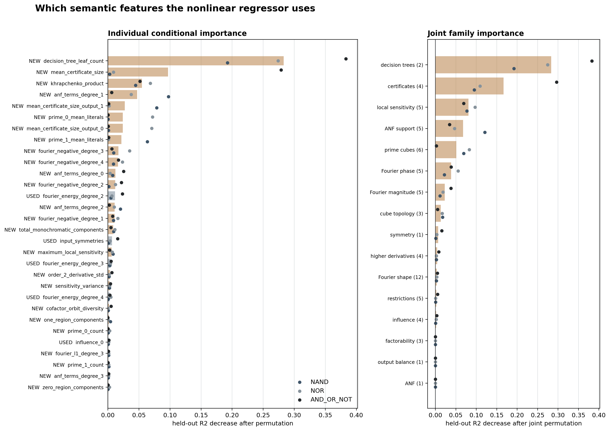

# Conditional feature importance

A nonlinear histogram-gradient-boosting regressor was evaluated with five-fold
holdout of complete 66-feature descriptor classes. Each class is represented
once during fitting, weighted by its number of Boolean functions; evaluation
restores the irreducible within-class error. Importance is the decrease in
held-out R2 after permuting a feature across descriptor classes, averaged over
5 folds and 8 permutations per fold.

Individual importance can be suppressed by correlated substitutes. The family
analysis therefore permutes every coordinate in a conceptual family jointly.
Negative values mean the permutation marginally improved generalization and
should be interpreted as zero importance, not as a beneficial feature.



## Held-out regression performance

|   index | language   |   r2_mean |   r2_std |
|--------:|:-----------|----------:|---------:|
|       0 | AND_OR_NOT |    0.9732 |   0.0039 |
|       1 | NAND       |    0.9570 |   0.0050 |
|       2 | NOR        |    0.9467 |   0.0083 |

## Individual ranking

| feature                        | status   | family             |   importance_mean |
|:-------------------------------|:---------|:-------------------|------------------:|
| decision_tree_leaf_count       | new      | decision trees     |            0.2831 |
| mean_certificate_size          | new      | certificates       |            0.0968 |
| khrapchenko_product            | new      | local sensitivity  |            0.0549 |
| anf_terms_degree_1             | new      | ANF support        |            0.0470 |
| mean_certificate_size_output_1 | new      | certificates       |            0.0272 |
| prime_0_mean_literals          | new      | prime cubes        |            0.0241 |
| mean_certificate_size_output_0 | new      | certificates       |            0.0241 |
| prime_1_mean_literals          | new      | prime cubes        |            0.0219 |
| fourier_negative_degree_3      | new      | Fourier phase      |            0.0170 |
| fourier_negative_degree_4      | new      | Fourier phase      |            0.0164 |
| anf_terms_degree_0             | new      | ANF support        |            0.0121 |
| fourier_negative_degree_2      | new      | Fourier phase      |            0.0118 |
| fourier_energy_degree_2        | used     | Fourier magnitude  |            0.0114 |
| anf_terms_degree_2             | new      | ANF support        |            0.0108 |
| fourier_negative_degree_1      | new      | Fourier phase      |            0.0108 |
| total_monochromatic_components | new      | cube topology      |            0.0084 |
| input_symmetries               | used     | symmetry           |            0.0068 |
| maximum_local_sensitivity      | new      | local sensitivity  |            0.0060 |
| fourier_energy_degree_3        | used     | Fourier magnitude  |            0.0040 |
| order_2_derivative_std         | new      | higher derivatives |            0.0034 |
| sensitivity_variance           | new      | local sensitivity  |            0.0032 |
| fourier_energy_degree_4        | used     | Fourier magnitude  |            0.0028 |
| cofactor_orbit_diversity       | new      | restrictions       |            0.0019 |
| one_region_components          | new      | cube topology      |            0.0014 |
| prime_0_count                  | new      | prime cubes        |            0.0012 |
| influence_0                    | used     | influence          |            0.0011 |
| fourier_l1_degree_3            | new      | Fourier shape      |            0.0010 |
| prime_1_count                  | new      | prime cubes        |            0.0010 |
| anf_terms_degree_3             | new      | ANF support        |            0.0010 |
| zero_region_components         | new      | cube topology      |            0.0009 |

## Joint family ranking

| family             |   features |   importance_mean |
|:-------------------|-----------:|------------------:|
| decision trees     |          2 |            0.2831 |
| certificates       |          4 |            0.1669 |
| local sensitivity  |          5 |            0.0812 |
| ANF support        |          5 |            0.0677 |
| prime cubes        |          6 |            0.0514 |
| Fourier phase      |          5 |            0.0388 |
| Fourier magnitude  |          5 |            0.0228 |
| cube topology      |          3 |            0.0130 |
| symmetry           |          1 |            0.0068 |
| higher derivatives |          4 |            0.0045 |
| Fourier shape      |         12 |            0.0036 |
| restrictions       |          5 |            0.0023 |
| influence          |          4 |            0.0020 |
| factorability      |          3 |            0.0001 |
| output balance     |          1 |            0.0001 |
| ANF                |          1 |           -0.0000 |

## Interpretation rule

- High standalone association but low permutation importance means the feature
  is largely redundant with other coordinates.
- High individual importance means the fitted regression function specifically
  depends on that coordinate.
- High family importance means the underlying kind of structure matters even
  when its individual coordinates substitute for one another.

This is predictive importance, not a causal or lower-bound theorem.

## Reproduce

```powershell
python experiments/semantic-boolean-complexity-4bit/scripts/analyze_feature_importance.py
```
